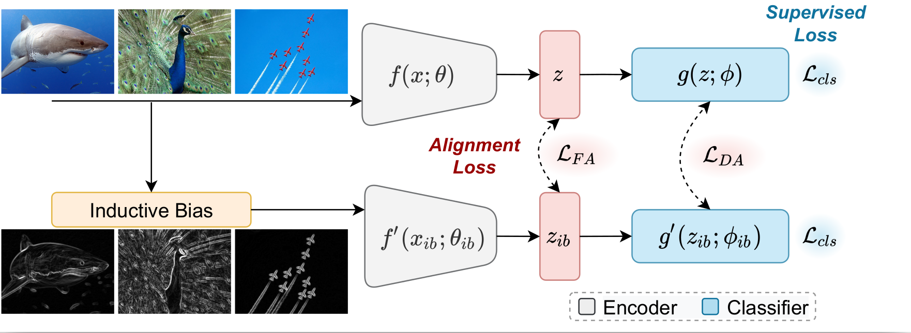
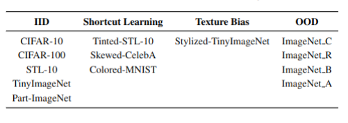
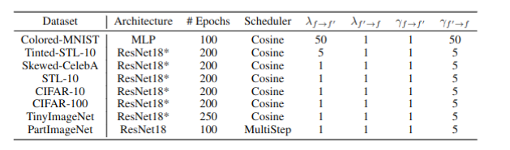

This is the official code for CoLLAs 2022 paper, "InBiaseD: Inductive Bias Distillation to Improve Generalization and Robustness through Shape-awareness" by Shruthi Gowda, Elahe Arani and Bahram Zonooz.

## Methodology
```
Network : Resnet18 
```
#### InBiaseD framework

There are 2 networks:
InBiaseD-network receiving RGB images and 
Shape-network receiving shape images. InBiaseD is used for inference.



## Datasets and Setup



The learning rate is set to $0.1$ (except for C-MNIST where it is $0.01$). SGD optimizer is used with a momentum of 0.9 and a weight decay of 1e-4. The same settings as for baselines are used for training InBiaseD. We apply random crop and random horizontal flip as the augmentations for all training.
Resnet-18* refers to the CIFAR-version in which the first convolutional layer has 3x3 kernel and the maxpool operation is removed.



## Requirements
- python==3.8.0
- torch==1.10.0
- torchvision==0.8.0 

## Running 

#### Train Baseline

```
python train_normal.py 
--exp_identifier train_tinyimagenet_baseline
--model_architecture ResNet18
--dataset tinyimagenet
--data_path <path to tinyimagenet dataset>
--lr 0.1
--weight_decay 0.0005
--batch_size 128
--epochs 250
--cuda
--test_eval_freq 100
--train_eval_freq 100
--seeds 0 10 20
--ft_prior std
--scheduler cosine
--output_dir /tinyimagenet_baseline
```
#### Train InBiaseD

```
python train_inbiased.py 
--exp_identifier train_tinyimagenet_inbiased
--model1_architecture ResNet18
--model2_architecture ResNet18
--dataset tinyimagenet
--data_path <path to tinyimagenet dataset>
--lr 0.1
--weight_decay 0.0005
--batch_size 128
--epochs 250
--cuda
--test_eval_freq 100
--train_eval_freq 100
--seeds 0 10 20
--ft_prior sobel
--loss_type kl fitnet
--loss_wt_kl1 1
--loss_wt_kl2 1
--loss_wt_at1 1
--loss_wt_at2 5
--scheduler cosine
--output_dir /tinyimagenet_inbiased
```

### Test
#### For evaluation only one network is used - InBiaseD network (the first network)
```
python test.py 
--dataset
tinyimagenet
--data_path
<path to tinyimagenet dataset>
--model_path
/tinyimagenet_inbiased/final_model1.pth
--cuda
--output_dir
/tinyimagenet_inbiased/results_inbiased
```

#### For results of shapeNet (second network)
```
python test.py 
--dataset
tinyimagenet
--data_path
<path to tinyimagenet dataset>
--model_path
/tinyimagenet_inbiased/final_model2.pth
--cuda
--output_dir
/tinyimagenet_inbiased/results_shapenet
```

#### For Ensemble of InBiaseD Networks:

For evaluation only one network is used - the InBiaseD network (the first network)
```
python ensemble.py 
--dataset
tinyimagenet
--data_path
<path to tinyimagenet dataset>
--model_path1
/tinyimagenet_inbiased/final_model1.pth
--model_path2
/tinyimagenet_inbiased/final_model2.pth
--cuda
--output_dir
/tinyimagenet_inbiased/results_ensemble
```

## Cite Our Work

## License

This project is licensed under the terms of the MIT license.

